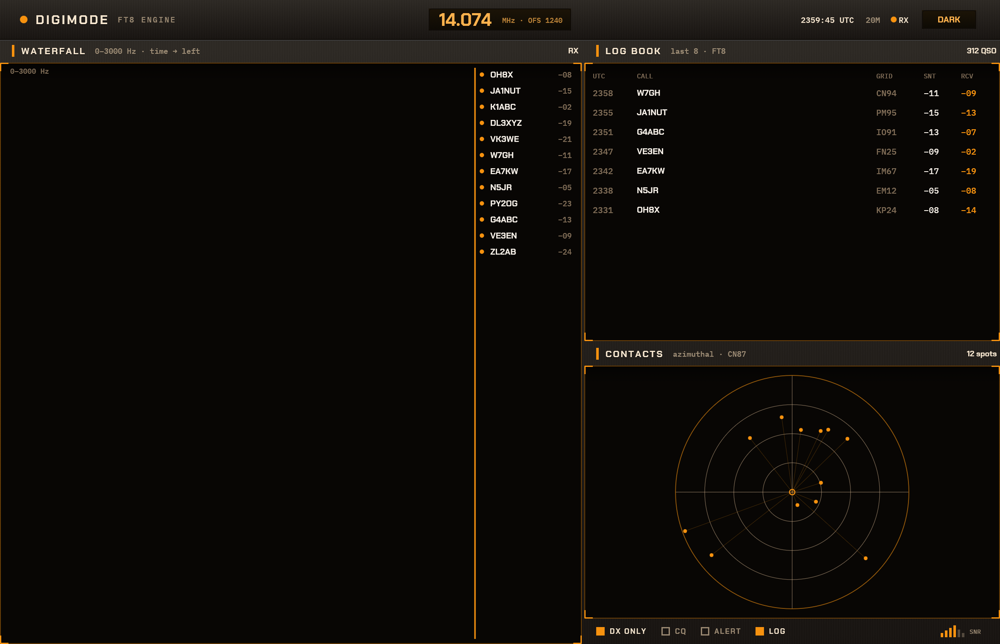
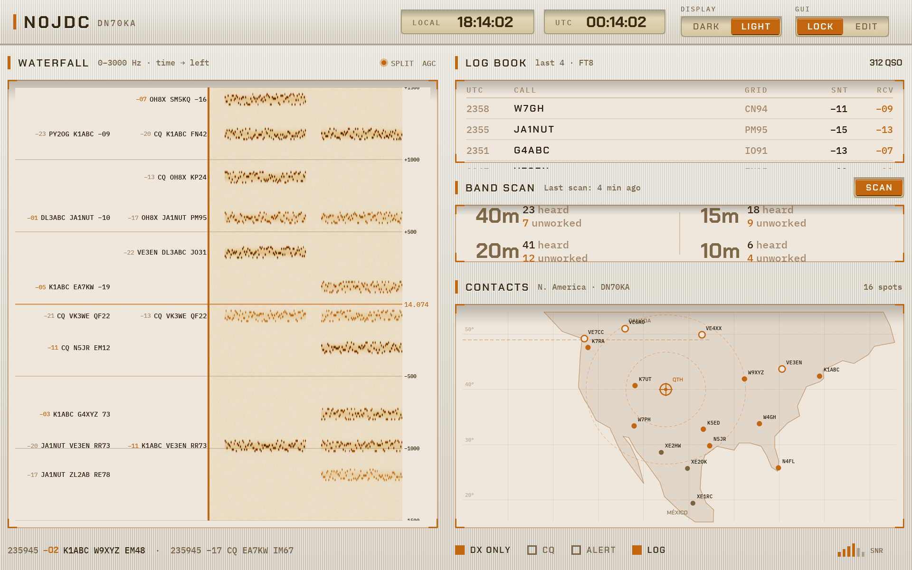

# FEASIBILITY — "Martian Hybrid" theme in egui + egui_tiles

Spike crate: `martian_hybrid` (eframe/egui **0.34.3**, egui_tiles **0.15.0**, egui_extras 0.34.3).
Run with `cargo run`. Screenshots in `screenshots/` (dark, light).

| Dark — "graphite" | Light — "silver" |
|---|---|
|  |  |

## 1. Verdict

**Moderate — and closer to easy than painful.** The whole theme is reproducible with
stock egui primitives plus a couple of small custom painters. There is no point where egui
or egui_tiles actively blocked the look; the only real friction is cosmetic (no
letter-spacing, gradients are hand-built meshes). A single developer got all eight
acceptance criteria met in one sitting.

## 2. Per-technique notes (confirming the brief's technique map)

| Theme element | Verdict | Notes |
|---|---|---|
| Panel frames / strokes / radius / fills | **Easy — confirmed** | `Painter::rect_filled` / `rect_stroke` with `CornerRadius` + `StrokeKind::Inside`. I painted frames directly rather than via `egui::Frame`, because inside `pane_ui` you already have the rect and want pixel control. |
| Corner brackets, spine bars, bar-graph | **Easy — confirmed** | `line_segment` / `rect_filled`. Flush brackets = inset the stroke by half its width so it lands fully inside the rect. |
| Flat square toggles | **Easy — confirmed** | `rect_filled` (on) / `rect_stroke` (off). Made them genuinely interactive with `ui.interact(sense=click)` over the square. |
| Custom fonts | **Easy — confirmed** | `FontDefinitions` + vendored TTFs. Chakra Petch → a named `FontFamily::Name("heading")`; IBM Plex Mono → `FontFamily::Monospace`. Worked first try. |
| egui's own widget theming | **Easy — confirmed** | `Visuals` overrides + `set_visuals`. Only the `egui_extras` table actually leans on this; everything else is hand-painted so it's palette-driven directly. |
| Face & LCD **gradients** | **Easy/Medium — easier than billed** | A 4-vertex vertex-colored `Mesh` (`colored_vertex` + two `add_triangle`s) is ~10 lines and reusable. Used for the chassis face, the LCD windows, and the recessed top-edge shade. Not a headache. |
| **Brushed-metal texture** | **Medium — confirmed, with a simplification** | Generate a 2×1 `ColorImage` (one light, one dark column) once, upload with `TextureOptions::NEAREST_REPEAT`, then paint a textured `Mesh` with `uv.x` running 0..width/2 so it tiles. The wrap-repeat path is the non-obvious bit. Honest caveat: at the spec'd alphas (~0.02 dark) the brushing is *very* subtle on screen — correct to the tokens, but you have to look for it. Regenerated per palette on flip. |
| **Recessed / inset bevel** | **Medium — confirmed** | No inset-shadow primitive, exactly as warned. Faked with: flat `screen_bg` fill + 1px accent ring (`StrokeKind::Inside`) + a short top-edge dark→transparent gradient mesh. Reads as recessed. The brackets sell it more than the bevel does. |
| Engraved text-shadow | **Easy — confirmed** | Draw the galley twice, 1px offset, shadow color first. One helper. |
| `letter-spacing` on tracked caps | **Minor annoyance — confirmed** | `RichText` has no letter-spacing. I interleave U+2009 thin spaces (`tracked()`), which is good enough for legends/labels but is a hack and slightly inflates measured widths. A production theme that cares would hand-lay glyphs or patch the galley. |
| Glows (LCD text) | **Skipped — agreed avoidable** | This theme is flat; the LCD reads fine without layered glows. |

New note not in the map: **manual text layout.** Because I paint most labels with
`Painter::text` rather than laying out widgets, I measure strings with
`painter.layout_no_wrap(...).size().x` to place adjacent items. Cheap and precise, but it's
manual — a production version would likely use real `Ui` horizontal layouts for anything
that needs to reflow.

## 3. egui_tiles assessment (the main thing to evaluate)

**This cooperated far better than expected — it's the good-news headline of the spike.**

- **The key finding:** with `SimplificationOptions { all_panes_must_have_tabs: false }`
  (the default), panes that live inside **linear split containers draw no tab bar at all**.
  Because the brief wanted splits, not tabs, ~80% of "suppress the library's chrome" simply
  evaporates — there is no tab bar, tab button, or container header to fight. `pane_ui` hands
  you the bare pane rect and you own every pixel.
- **Grooves through gaps = one line.** `fn gap_width()` → `3.0`. The chassis is painted across
  the whole `CentralPanel` *before* `tree.ui(...)`, and each pane only fills its recessed
  screen sub-rect, so the gaps (and the per-pane header/footer bands) show the metal through.
  This is exactly the mechanism the brief hoped for and it worked verbatim.
- **Resize visuals cooperated.** `fn resize_stroke(state)` lets you return `Stroke::NONE` when
  idle (so the groove stays clean metal) and a thin accent line on hover/drag. Dragging the
  splitters works and re-themes correctly. No drag-reorder tab chrome to suppress since there
  are no tabs.
- **Tree building is ergonomic.** `Tiles::insert_pane` + `insert_vertical_tile` /
  `insert_horizontal_tile`, then bias the split with `Container::Linear`'s `shares.set_share`.

Net: for a **split-based dashboard**, egui_tiles needed *almost no* chrome suppression — just
`gap_width` and `resize_stroke`. The library's heavier chrome (tab bars, drag-reorder) only
shows up if you opt into tab containers, which this design doesn't. Had the design wanted
tabs styled this way, the lift would be meaningfully larger (you'd be overriding
`tab_bg_color`, `tab_text_color`, `tab_bar_color`, `tab_outline_stroke`, `tab_bar_height`,
etc. — all of which exist, but that's a pile of hooks).

## 4. Rough effort estimate: spike → polished production theme

- Spike (this): **~1 focused day.**
- To production-grade reusable theme: **roughly 3–5 additional days**, mostly polish, not risk:
  - Wrap the painters into a small reusable `Panel`/`Frame` abstraction so feature panes don't
    each hand-roll header/screen/footer geometry.
  - A real letter-spacing solution (galley patching) if leadership cares about exact tracking.
  - DPI/rounding cleanups (1px strokes can shimmer at fractional scales).
  - Theme as data (serde-loadable palettes) + an animated light/dark crossfade if wanted.
  - Make the brushed texture resolution-aware and tune alphas so the brushing is visible
    without looking noisy.
  - Real panel contents (the actual waterfall/log/map widgets) — out of scope here but that's
    where the bulk of any real product time goes, independent of theme.

## 5. Recommendation

**GO.** egui can carry this instrument-panel aesthetic comfortably, and egui_tiles is a good
fit *specifically because* the design uses splits rather than tabs — that choice sidesteps the
library's most opinionated chrome. Nothing in the spike surfaced a wall. The two things to
keep on the radar for production are (a) the letter-spacing hack and (b) tuning the brushed
texture so it's perceptible; both are polish, not blockers.

One design note worth flagging back: the brushed-metal brushing at the spec'd dark-mode alphas
is nearly invisible on a real display. The token values are reproduced faithfully, but if the
"brushed" read matters, the design should either raise those alphas or accept that dark mode
is effectively a smooth gradient.

---

### Acceptance criteria — all met

- [x] `cargo run` launches the app.
- [x] Full-width header strip: title, fake frequency readout (`14.074 MHz · OFS 1240`), light/dark toggle.
- [x] ≥3 panels visible at once (Waterfall / Log Book / Contacts), laid out + resizable via egui_tiles **splits**.
- [x] Brushed-metal chassis shows behind/between panels; gaps read as grooves.
- [x] Each panel: recessed screen + 1px accent ring + accent corner brackets **flush to corners** + spine-marked header.
- [x] Contacts panel carries the flat square-toggle footer (solid = on, hollow = off) + bar-graph. No screws, no glossy switches.
- [x] Correct fonts (Chakra Petch headings, IBM Plex Mono data).
- [x] Both palettes switch at runtime (chassis, screens, brackets, text, brushed texture all update).

### Notes for the reader
- `screenshots/dark.png`, `screenshots/light.png` were produced by the app's own headless
  capture path (`MARTIAN_SHOT=<path> [MARTIAN_LIGHT=1] cargo run`), which renders a few frames,
  saves a PNG via `ViewportCommand::Screenshot`, and exits.
- **macOS exit crash (handled):** winit on macOS can throw an uncaught `NSRangeException`
  while tearing down the window's responder chain on quit — it tries to remove an automatic
  Touch Bar KVO observer (`_NSTouchBarFinderObservation` on the `nextResponder` key path) that
  was never registered. It's an upstream AppKit/winit bug, not our code, and fires *after* the
  window is already gone. Worked around in `App::ui` by checking `close_requested()` and
  calling `std::process::exit(0)`, so the process exits before AppKit runs the faulty teardown.
- Click the **DARK/LIGHT** chip in the header to flip palettes at runtime; click the footer
  squares to toggle them.
